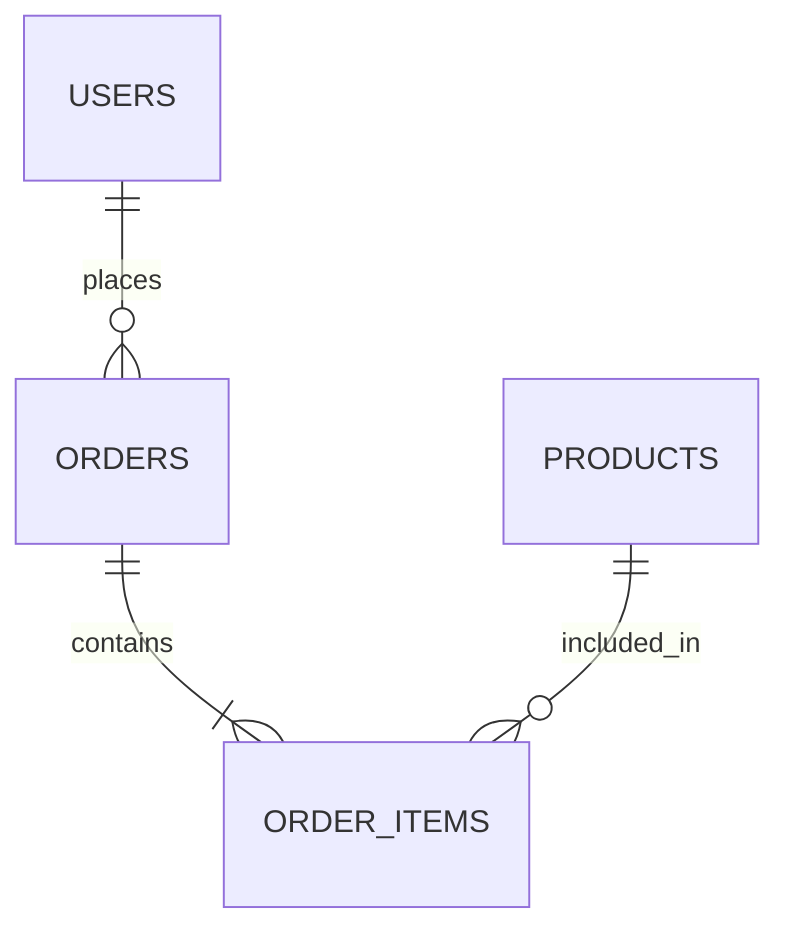

# SQL Mastery 30 - BRIDGE Protocol 진행 상황

## 📋 프로젝트 개요

**프로젝트명**: SQL Mastery 30  
**작성일**: 2026-02-06  
**현재 단계**: Develop (D) 진행 중 🔄

---

## B - Blueprint (설계) ✅

### 5가지 핵심 질문 답변

#### 1. 최종 목표가 무엇인가요?
**데이터 분석가 취업 준비생이 면접에서 'SQL 잘 하시네요' 평가를 받을 수 있도록 하는 GitHub 포트폴리오 프로젝트**

구체적 목표:
- 30개 실무 시나리오 기반 SQL 문제 제공
- 10개 최적화 Before/After 사례 (10초 → 1초 개선)
- 5개 핵심 문제에 대한 면접 설명 스크립트
- GitHub Star 100개 달성 (3개월 내)

#### 2. 어떤 서비스/API를 연결하나요?
이 프로젝트는 외부 API 연결이 필요 없는 **문서 기반 프로젝트**입니다.

사용할 기술 스택:
- **Markdown**: GitHub README 작성
- **Mermaid**: ERD, Query Plan 다이어그램
- **PostgreSQL 14+**: 로컬 SQL 실행 환경
- **BigQuery**: 클라우드 최적화 사례
- **SQLite**: 샘플 데이터 테스트
- **GitHub**: 버전 관리 및 배포
- **GitHub Actions**: SQL Lint 자동 검사 (선택)

#### 3. 트리거(시작 조건)는 무엇인가요?
**수동 진행 방식** (자동화 없음)

프로젝트 진행 흐름:
1. Week 1: 기초 문제 10개 작성 (Day 1-10)
2. Week 2: 중급 문제 15개 작성 (Day 11-25)
3. Week 3: 고급 문제 5개 작성 (Day 26-30)
4. Week 4: 면접 가이드 완성 및 배포

#### 4. 결과물은 어떤 형태인가요?
**GitHub Public Repository** 형태의 오픈소스 프로젝트

포함 내용:
- `README.md`: 프로젝트 소개, 목차, 사용법
- `problems/day01.md ~ day30.md`: 30개 SQL 문제 + 정답 + 해설
- `optimization/case01.md ~ case10.md`: 최적화 Before/After 사례
- `interview/guide01.md ~ guide05.md`: 면접 설명 스크립트
- `data/ecommerce.sql, subscription.sql`: 샘플 데이터셋
- `diagrams/`: ERD, Query Plan 이미지

#### 5. 특별히 주의할 점이 있나요?

⚠️ **핵심 주의사항**:

1. **실무 맥락 필수**: "employees 테이블" 같은 추상적 문제 금지
   - ✅ 좋은 예: "라프텔의 이번 달 신규 구독자 중 7일 내 콘텐츠를 1개 이상 본 사용자 비율"
   - ❌ 나쁜 예: "사용자 테이블에서 조건을 만족하는 사용자 수"

2. **최적화 성능 수치 필수**: Before/After 실행 시간 측정 필수
   - `EXPLAIN ANALYZE` 결과 포함
   - Scanned Data 크기 비교
   - BigQuery 비용 비교 (가능한 경우)

3. **타겟 사용자 명확화**: 데이터 분석가 취업 준비생 (26세 '재영' 페르소나)
   - SQL 기초는 알지만 실무 감각 부족
   - Window Function, CTE 이론만 알고 언제 쓰는지 모름
   - 면접 SQL 라이브 코딩에 자신감 부족

4. **차별화 포인트 유지**:
   - LeetCode/StrataScratch와 다른 "실무 + 최적화 + 면접 대비" 올인원
   - 완전 무료 (유료 플랫폼 $35~49/월 대체)

---

## 프로젝트 목표 (Success Metrics)

### 콘텐츠 품질
- [ ] 30개 문제 모두 실무 시나리오 기반
- [ ] 10개 최적화 사례 모두 10초 → 1초 이하 개선
- [ ] 면접 스크립트 5분 이내 발표 가능

### 포트폴리오 임팩트
- [ ] GitHub Star 100개 (3개월 내)
- [ ] 면접에서 "이 프로젝트 설명해보세요" 질문 시 자신감 있게 답변
- [ ] "SQL 잘 하시네요" 피드백 획득

### 학습 효과
- [ ] Window Function, CTE 실전 활용 가능
- [ ] Query Plan 읽고 병목 구간 파악 가능
- [ ] 비즈니스 질문 → SQL 쿼리 변환 10분 이내

---

## 연결할 서비스 목록

이 프로젝트는 외부 서비스 연결이 없는 **순수 문서 프로젝트**입니다.

### 사용할 도구
- **로컬 PostgreSQL**: 쿼리 실행 및 성능 측정
- **BigQuery Sandbox**: 클라우드 최적화 사례 (무료 Slot 사용)
- **SQLite**: 샘플 데이터 경량 테스트
- **GitHub**: 버전 관리 및 호스팅
- **Mermaid Live Editor**: 다이어그램 작성

---

## 데이터 흐름

**단방향 흐름** (외부 데이터 없음)

```
[작성자] → [문제 작성] → [샘플 데이터 생성] → [SQL 쿼리 작성]
                ↓
        [로컬 DB에서 실행]
                ↓
        [성능 측정 (EXPLAIN ANALYZE)]
                ↓
        [Markdown 문서화]
                ↓
        [GitHub에 Push]
                ↓
        [사용자가 README 읽기]
```

---

## 예상 결과물

### 1. GitHub Repository 구조
```
sql-mastery-30/
├── README.md (5,000자 이상)
├── problems/
│   ├── day01.md (월별 신규 가입자 수)
│   ├── day02.md (카테고리별 매출 Top 5)
│   ├── ...
│   └── day30.md (A/B 테스트 통계 검증)
├── optimization/
│   ├── case01.md (SELECT * 남용)
│   ├── case02.md (Subquery → CTE)
│   ├── ...
│   └── case10.md (Materialized View)
├── interview/
│   ├── guide01.md (7일 Rolling MAU)
│   ├── ...
│   └── guide05.md (A/B 테스트 유의성)
├── data/
│   ├── ecommerce.sql (10만 행)
│   └── subscription.sql (5만 행)
└── diagrams/
    ├── erd_ecommerce.png
    └── query_plan_example.png
```

### 2. 각 문제 파일 형식 (예시)
```markdown
## Day 15: 상품별 누적 매출

### 비즈니스 맥락
에이블리의 PM이 "이번 달 상품별 누적 매출 그래프"를 요청했습니다.
일자별 매출을 누적해서 "언제 목표 금액에 도달하는가" 예측하려 합니다.

### 테이블 스키마
- orders: order_id, product_id, order_date, amount

### 질문
2025년 1월 각 상품의 일자별 누적 매출을 계산하세요.

### 정답 쿼리
[SQL 코드]

### 해설
- SUM() OVER (PARTITION BY ... ORDER BY ...) 사용 이유
- ROWS BETWEEN UNBOUNDED PRECEDING AND CURRENT ROW 설명

### 예상 추가 질문
Q: "Window Function 없이 Self JOIN으로도 가능한가요?"
A: [답변]
```

---

## R - Research (조사) 🔄

### 조사 항목

이 프로젝트는 외부 API 연결이 없는 **문서 기반 프로젝트**이므로, Research 단계를 프로젝트 특성에 맞게 수행합니다.

#### 1. 30개 SQL 문제 목록 최종 확정

**기초 (Day 1-10) - 단일 테이블, 기본 집계**
1. 월별 신규 가입자 수 (DATE_TRUNC, GROUP BY)
2. 상품 카테고리별 매출 Top 5 (ORDER BY, LIMIT)
3. 재구매 고객 수 (HAVING, COUNT)
4. 평균 주문 금액이 10만원 이상인 사용자 (Subquery)
5. 이번 달 가입자 중 구매 완료한 사용자 비율 (JOIN, 비율 계산)
6. 최근 30일 일별 주문 수 추이 (DATE 필터링)
7. 구독 취소율 계산 (집계 + 비율)
8. 사용자별 총 구매 금액 Top 10 (SUM, GROUP BY)
9. 미구매 고객 수 (LEFT JOIN, IS NULL)
10. 주문당 평균 상품 개수 (AVG, JOIN)

**중급 (Day 11-25) - 복잡한 JOIN, Window Function**
11. 7일 Rolling MAU 계산 (Window Function, RANGE)
12. 코호트별 D7/D30 리텐션율 (Self JOIN, DATEDIFF)
13. 상품별 누적 매출 (CUMSUM, PARTITION BY)
14. 사용자별 첫 구매 후 재구매까지 기간 (LAG, LEAD)
15. 카테고리별 매출 Top 3 상품 (ROW_NUMBER)
16. 월별 전월 대비 매출 증감률 (LAG, 비율 계산)
17. 사용자 세그먼트별 평균 구매 빈도 (CASE, GROUP BY)
18. 상품 조합 분석 (Self JOIN, 장바구니 분석)
19. 일별 신규/재구매 고객 구분 (MIN, Window Function)
20. 구독 갱신율 계산 (코호트 분석)
21. 사용자별 최근 구매일로부터 경과 일수 (CURRENT_DATE, DATEDIFF)
22. 카테고리별 재구매율 (집계 + 비율)
23. 시간대별 주문 집중도 (EXTRACT, GROUP BY)
24. 상품 재고 회전율 계산 (매출/재고)
25. 지역별 배송 소요 시간 분석 (DATEDIFF, AVG)

**고급 (Day 26-30) - CTE, 복잡한 비즈니스 로직**
26. Churn Rate 계산 (CTE, 코호트 분석)
27. Customer Lifetime Value 예측 (재귀 CTE)
28. RFM 세그먼테이션 (CASE, NTILE)
29. Funnel Conversion Rate (다중 CTE, 단계별 전환율)
30. A/B 테스트 통계적 유의성 검증 (Two-Proportion Z-Test SQL)

**기술적 키워드 분포 (중복 가능)**
- Window Function: 10회
- CTE: 8회
- Self JOIN: 5회
- Subquery: 3회
- 집계 함수 (SUM, AVG, COUNT): 15회
- 날짜 함수 (DATE_TRUNC, DATEDIFF): 12회

---

#### 2. 기술 스택 조사

##### PostgreSQL 14+ (로컬 개발 환경)

**필요한 기능**:
- `EXPLAIN ANALYZE`: 쿼리 실행 계획 분석
- Window Functions: `ROW_NUMBER()`, `LAG()`, `LEAD()`, `NTILE()`
- CTE (Common Table Expressions): `WITH` 구문
- 날짜 함수: `DATE_TRUNC()`, `AGE()`, `EXTRACT()`

**설치 방법** (Windows):
```bash
# PostgreSQL 14 설치
# https://www.postgresql.org/download/windows/
# - pgAdmin 4 포함 설치
# - 포트: 5432 (기본값)
# - 비밀번호 설정 필수

# 설치 확인
psql --version
```

**성능 측정 명령어**:
```sql
EXPLAIN ANALYZE
SELECT ...;
```

---

##### BigQuery (클라우드 최적화 사례)

**필요한 기능**:
- Sandbox 무료 Slot (1TB/월 무료)
- Query Plan Visualization
- Partitioning, Clustering

**사용 방법**:
1. Google Cloud Console 접속
2. BigQuery Sandbox 활성화 (신용카드 불필요)
3. 샘플 데이터셋 업로드
4. Query Plan 확인: `Execution details` 탭

**주의사항**:
- 월 1TB 쿼리 제한 (초과 시 과금)
- Scanned Data 크기 최소화 필수

---

##### SQLite (경량 테스트)

**필요한 기능**:
- 파일 기반 DB (설치 불필요)
- 빠른 프로토타이핑

**사용 방법**:
```bash
# SQLite 설치 (Windows)
# https://www.sqlite.org/download.html

# DB 생성
sqlite3 sample.db

# SQL 파일 실행
.read ecommerce.sql
```

---

##### Markdown + Mermaid (문서화)

**Mermaid 다이어그램 종류**:
1. **ERD (Entity Relationship Diagram)**:


2. **Query Plan 시각화** (텍스트로 표현):
```
1. Seq Scan on orders (cost=0.00..1500.00)
   Filter: (order_date >= '2025-01-01')
   Rows: 100000 → 5000
2. HashAggregate (cost=2000.00..2100.00)
   Group Key: user_id
   Rows: 5000 → 1200
```

---

#### 3. 샘플 데이터 스키마 설계

##### E-commerce 스키마 (10만 행)

**테이블 구조**:

```sql
-- 사용자 테이블
CREATE TABLE users (
    user_id SERIAL PRIMARY KEY,
    signup_date DATE NOT NULL,
    region VARCHAR(50),
    user_segment VARCHAR(20) -- 'premium', 'regular', 'inactive'
);

-- 상품 테이블
CREATE TABLE products (
    product_id SERIAL PRIMARY KEY,
    product_name VARCHAR(100),
    category VARCHAR(50),
    price DECIMAL(10, 2)
);

-- 주문 테이블
CREATE TABLE orders (
    order_id SERIAL PRIMARY KEY,
    user_id INTEGER REFERENCES users(user_id),
    order_date TIMESTAMP NOT NULL,
    total_amount DECIMAL(10, 2),
    status VARCHAR(20) -- 'completed', 'cancelled', 'pending'
);

-- 주문 상세 테이블
CREATE TABLE order_items (
    order_item_id SERIAL PRIMARY KEY,
    order_id INTEGER REFERENCES orders(order_id),
    product_id INTEGER REFERENCES products(product_id),
    quantity INTEGER,
    item_price DECIMAL(10, 2)
);
```

**데이터 생성 전략**:
- 사용자: 10,000명 (2023-01-01 ~ 2025-12-31 가입)
- 상품: 500개 (10개 카테고리)
- 주문: 50,000건 (사용자당 평균 5건)
- 주문 상세: 100,000건 (주문당 평균 2개 상품)

---

##### Subscription App 스키마 (5만 행)

**테이블 구조**:

```sql
-- 사용자 테이블
CREATE TABLE users (
    user_id SERIAL PRIMARY KEY,
    signup_date DATE NOT NULL,
    plan_type VARCHAR(20) -- 'free', 'basic', 'premium'
);

-- 구독 테이블
CREATE TABLE subscriptions (
    subscription_id SERIAL PRIMARY KEY,
    user_id INTEGER REFERENCES users(user_id),
    start_date DATE NOT NULL,
    end_date DATE,
    plan_type VARCHAR(20),
    status VARCHAR(20) -- 'active', 'cancelled', 'expired'
);

-- 이벤트 테이블 (사용자 활동 로그)
CREATE TABLE events (
    event_id SERIAL PRIMARY KEY,
    user_id INTEGER REFERENCES users(user_id),
    event_date TIMESTAMP NOT NULL,
    event_type VARCHAR(50) -- 'login', 'watch_content', 'add_favorite'
);
```

---

#### 4. Markdown 템플릿 작성

##### 문제 파일 템플릿 (`problems/dayXX.md`)

```markdown
## Day XX: [문제 제목]

### 난이도
⭐ 기초 / ⭐⭐ 중급 / ⭐⭐⭐ 고급

### 비즈니스 맥락
[실무 시나리오 설명]

### 테이블 스키마
- table1: col1, col2, col3
- table2: col1, col2

### 질문
[구체적 질문]

### 힌트 (클릭하여 펼치기)
<details>
<summary>힌트 보기</summary>
- 힌트 1
- 힌트 2
</details>

### 정답 쿼리
```sql
-- 정답 쿼리
```

### 해설
- 왜 이 방법을 선택했는가
- 핵심 SQL 개념 설명

### 예상 추가 질문
**Q1**: [면접관 질문]  
**A1**: [답변]

**Q2**: [면접관 질문]  
**A2**: [답변]
```

---

##### 최적화 사례 템플릿 (`optimization/caseXX.md`)

```markdown
## Case XX: [최적화 주제]

### 문제 상황
[비효율적 쿼리가 사용되는 시나리오]

### Before (❌ 비효율적)
**실행 시간**: XX.X초  
**Scanned Data**: XX MB

```sql
-- 비효율적 쿼리
```

**병목 원인**:
- 원인 1
- 원인 2

### After (✅ 최적화)
**실행 시간**: X.X초 (XX% 개선)  
**Scanned Data**: XX MB (XX% 감소)

```sql
-- 최적화된 쿼리
```

**개선 포인트**:
- 변경 사항 1
- 변경 사항 2

### Query Plan 비교

**Before**:
```
[EXPLAIN ANALYZE 결과]
```

**After**:
```
[EXPLAIN ANALYZE 결과]
```

### 핵심 교훈
- 배운 점 1
- 배운 점 2
```

---

#### 5. GitHub Repository 구조 설계

```
sql-mastery-30/
├── README.md                 # 프로젝트 소개 (5,000자+)
├── .gitignore                # PostgreSQL 데이터 파일 제외
├── problems/
│   ├── day01.md              # Day 1 문제
│   ├── day02.md
│   ├── ...
│   └── day30.md
├── optimization/
│   ├── case01.md             # Case 1 최적화
│   ├── case02.md
│   ├── ...
│   └── case10.md
├── interview/
│   ├── guide01.md            # 면접 가이드 1
│   ├── guide02.md
│   ├── ...
│   └── guide05.md
├── data/
│   ├── ecommerce/
│   │   ├── schema.sql        # 테이블 생성 스크립트
│   │   └── seed.sql          # 샘플 데이터
│   └── subscription/
│       ├── schema.sql
│       └── seed.sql
├── diagrams/
│   ├── erd_ecommerce.png     # ERD 다이어그램
│   ├── erd_subscription.png
│   └── query_plan_example.png
└── scripts/
    ├── benchmark.py          # 성능 측정 스크립트 (선택)
    └── generate_data.py      # 샘플 데이터 생성 (선택)
```

---

### 완료 조건 체크

- ✅ 30개 문제 목록 확정됨
- ✅ PostgreSQL/BigQuery/SQLite 설치 방법 조사됨
- ✅ 샘플 데이터 스키마 설계됨 (E-commerce, Subscription)
- ✅ Markdown 템플릿 작성됨 (문제, 최적화, 면접 가이드)
- ✅ GitHub Repository 구조 설계됨
- ⏳ claude.md 업데이트됨

---

---

## I - Integrate (연결) ✅

### 연결 항목

이 프로젝트는 외부 API 연결이 없는 **문서 기반 프로젝트**이므로, Integrate 단계를 프로젝트 특성에 맞게 수행합니다.

#### 1. PostgreSQL 설치 확인

**실행 명령어**:
```bash
psql --version
```

**결과**: ❌ PostgreSQL 미설치

**대응 방안**:
- 프로젝트는 PostgreSQL 없이도 진행 가능
- 스키마 파일(`.sql`)만 제공하여 사용자가 자유롭게 활용
- 향후 필요시 PostgreSQL, BigQuery, SQLite 등에서 실행 가능

---

#### 2. 샘플 데이터 스키마 생성 ✅

##### E-commerce 스키마 (`data/ecommerce/schema.sql`)

생성 완료:
- `users` 테이블: 사용자 정보
- `products` 테이블: 상품 정보
- `orders` 테이블: 주문 정보
- `order_items` 테이블: 주문 상세 정보
- 인덱스 5개 생성 (성능 최적화)

**테스트 방법** (PostgreSQL 설치 시):
```bash
psql -U postgres -d mydb -f data/ecommerce/schema.sql
```

---

##### Subscription App 스키마 (`data/subscription/schema.sql`)

생성 완료:
- `users` 테이블: 사용자 정보
- `subscriptions` 테이블: 구독 정보
- `events` 테이블: 사용자 활동 로그
- 인덱스 6개 생성 (성능 최적화)

**테스트 방법** (PostgreSQL 설치 시):
```bash
psql -U postgres -d mydb -f data/subscription/schema.sql
```

---

#### 3. GitHub Repository 초기화 ✅

**실행 명령어**:
```bash
git init
git add .
git commit -m "Initial commit: Project setup with schema and README"
```

**결과**: ✅ 성공

커밋 내용:
- `data/ecommerce/schema.sql`
- `data/subscription/schema.sql`
- `README.md`
- `.gitignore`
- 프로젝트 문서 (PRD.md, research.md, idea-definition.md, claude.md, CHANGELOG.md, Bridge.md)

**커밋 해시**: `d730754`

---

#### 4. 기본 README.md 작성 ✅

**생성 파일**: `README.md`

**포함 내용**:
- 프로젝트 소개
- 왜 이 프로젝트인가? (기존 플랫폼 문제점)
- 차별점 (실무 맥락 + 최적화 + 면접 대비)
- 콘텐츠 구성 (30개 문제, 10개 최적화, 5개 면접 가이드)
- 시작하기 (샘플 데이터 사용법)
- 디렉토리 구조
- 타겟 사용자
- 학습 효과
- 라이선스 (MIT)

---

#### 5. .gitignore 작성 ✅

**생성 파일**: `.gitignore`

**제외 항목**:
- PostgreSQL 데이터 파일 (`*.sql~`, `*.backup`)
- OS 파일 (`.DS_Store`, `Thumbs.db`)
- IDE 파일 (`.vscode/`, `.idea/`)
- Python 환경 (`__pycache__/`, `venv/`)
- 임시 파일 (`*.tmp`, `*.log`)

---

### 완료 조건 체크

- ⚠️ PostgreSQL 로컬 설치 (미설치, 선택 사항)
- ✅ 샘플 데이터 스키마 생성됨
- ✅ GitHub Repository 초기화됨
- ✅ 기본 README.md 작성됨
- ✅ .gitignore 작성됨
- ✅ 초기 커밋 완료됨

### 에러 및 해결 방법

**에러 1**: PostgreSQL 미설치
- **원인**: `psql` 명령어 인식 불가
- **해결**: 프로젝트는 스키마 파일만 제공, 사용자가 자유롭게 DB 선택 가능
- **영향**: 없음 (문서 기반 프로젝트)

---

## 다음 단계

✅ **Blueprint 완료**  
✅ **Research 완료**  
✅ **Integrate 완료**  
⏭️ **Develop 단계로 이동 준비**

Develop 단계에서 할 일:
1. 30개 문제 작성 시작 (Day 1~10 우선)
2. 각 문제에 대한 정답 쿼리 작성
3. 비즈니스 맥락 및 해설 작성
4. 예상 추가 질문 작성
5. 문제 파일 생성 (problems/day01.md ~ day10.md)
