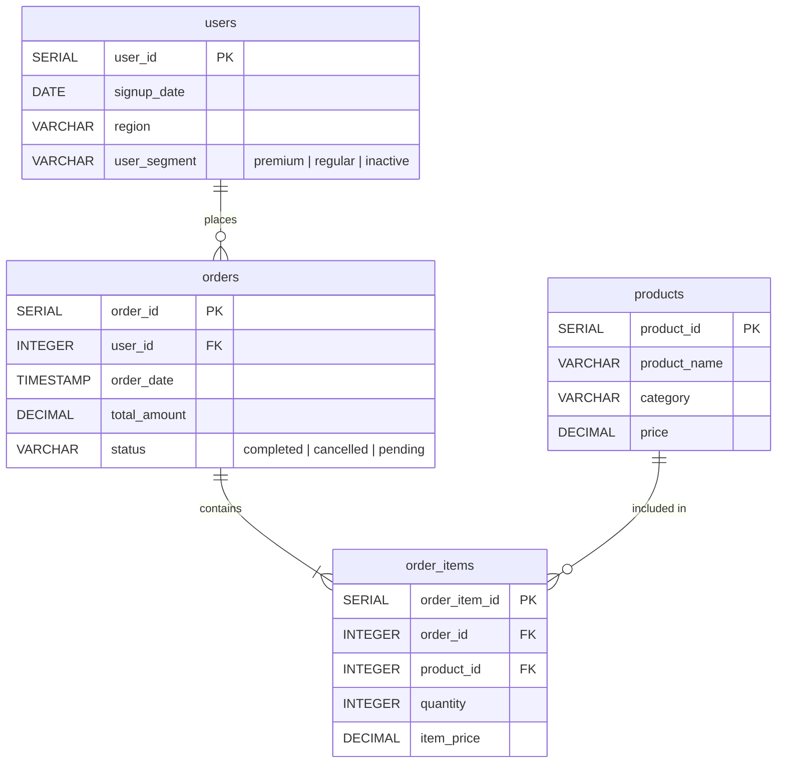

# E-commerce Database ERD

## Entity Relationship Diagram



## 테이블 관계 설명

| 관계 | 설명 | 카디널리티 |
|------|------|-----------|
| users → orders | 사용자가 주문을 생성 | 1:N (한 사용자가 여러 주문) |
| orders → order_items | 주문에 상품 포함 | 1:N (한 주문에 여러 상품) |
| products → order_items | 상품이 주문에 포함 | 1:N (한 상품이 여러 주문에) |

## 인덱스 구조

```
idx_users_signup_date       → users(signup_date)
idx_orders_user_id          → orders(user_id)
idx_orders_order_date       → orders(order_date)
idx_order_items_order_id    → order_items(order_id)
idx_order_items_product_id  → order_items(product_id)
```

## 데이터 규모

| 테이블 | 예상 레코드 수 | 비고 |
|--------|---------------|------|
| users | 1,000 | 2023~2025 가입 |
| products | 50 | 5개 카테고리 |
| orders | 5,000 | 사용자당 평균 5건 |
| order_items | 10,000 | 주문당 평균 2개 상품 |
