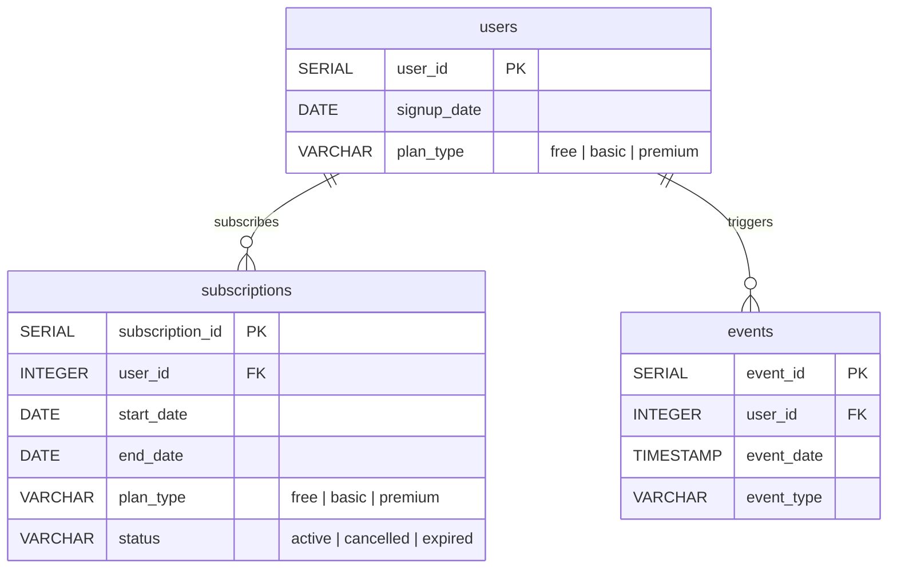

# Subscription App Database ERD

## Entity Relationship Diagram



## 테이블 관계 설명

| 관계 | 설명 | 카디널리티 |
|------|------|-----------|
| users → subscriptions | 사용자가 구독 생성 | 1:N (플랜 변경 이력 포함) |
| users → events | 사용자가 이벤트 발생 | 1:N (활동 로그) |

## 인덱스 구조

```
idx_users_signup_date        → users(signup_date)
idx_subscriptions_user_id    → subscriptions(user_id)
idx_subscriptions_status     → subscriptions(status)
idx_events_user_id           → events(user_id)
idx_events_event_date        → events(event_date)
idx_events_event_type        → events(event_type)
```

## 이벤트 타입 (event_type)

| event_type | 설명 | 사용처 |
|------------|------|--------|
| login | 로그인 | 퍼널 분석 Step 2 |
| content_view | 콘텐츠 조회 | 퍼널 분석 Step 3, 리텐션 |
| add_favorite | 즐겨찾기 추가 | 인게이지먼트 분석 |
| search | 검색 | 사용자 행동 분석 |
| share | 공유 | 바이럴 분석 |

## 데이터 규모

| 테이블 | 예상 레코드 수 | 비고 |
|--------|---------------|------|
| users | 500 | 2023~2025 가입 |
| subscriptions | 800 | 플랜 변경 이력 포함 |
| events | 25,000 | 사용자당 평균 50개 이벤트 |
